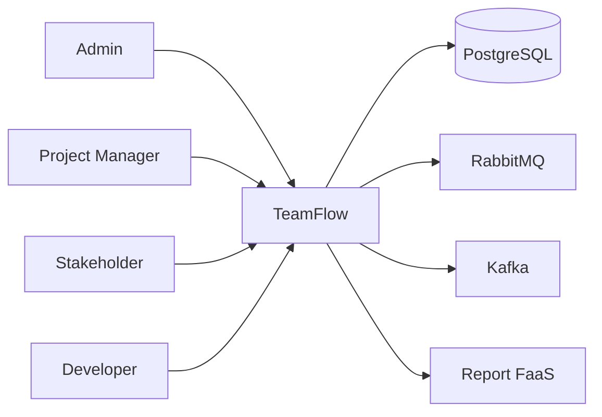
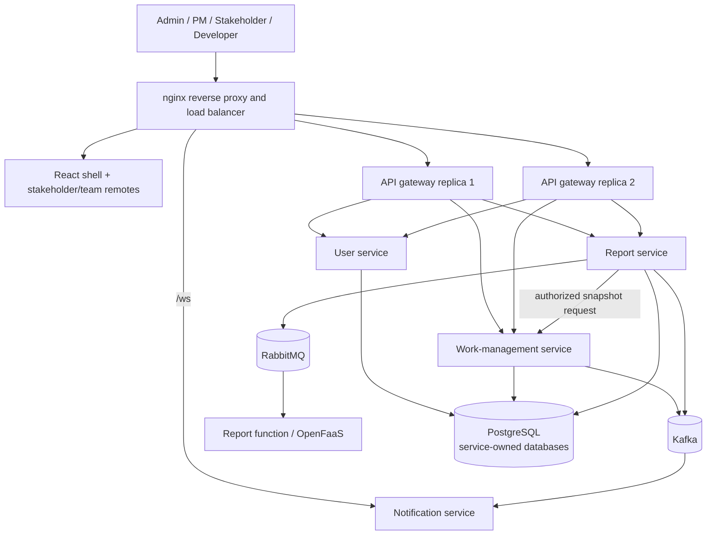
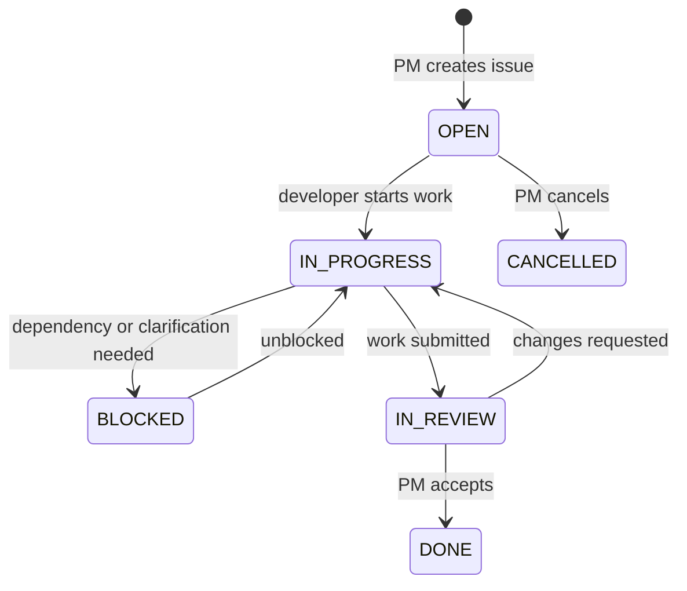

# C4 Model

## System context

```mermaid
flowchart LR
  A[Admin] --> T[TeamFlow]
  PM[Project Manager] --> T
  S[Stakeholder] --> T
  D[Developer] --> T
  T --> PG[(PostgreSQL)]
  T --> MQ[RabbitMQ]
  T --> K[Kafka]
  T --> F[Report FaaS]
```

## Containers

```mermaid
flowchart TB
  U[Admin / PM / Stakeholder / Developer] --> N[nginx reverse proxy and load balancer]
  N --> W[React shell + stakeholder/team remotes]
  N --> G1[API gateway replica 1]
  N --> G2[API gateway replica 2]
  N -->|/ws| NS[Notification service]
  G1 --> US[User service]
  G1 --> WM[Work-management service]
  G1 --> RS[Report service]
  G2 --> US
  G2 --> WM
  G2 --> RS
  RS -->|authorized snapshot request| WM
  WM --> K[(Kafka)]
  RS --> K
  K --> NS
  RS --> MQ[(RabbitMQ)]
  MQ --> F[Report function / OpenFaaS]
  US --> DB[(PostgreSQL<br/>service-owned databases)]
  WM --> DB
  RS --> DB
```

## Issue lifecycle

```mermaid
stateDiagram-v2
  [*] --> OPEN: PM creates issue
  OPEN --> IN_PROGRESS: developer starts work
  IN_PROGRESS --> BLOCKED: dependency or clarification needed
  BLOCKED --> IN_PROGRESS: unblocked
  IN_PROGRESS --> IN_REVIEW: work submitted
  IN_REVIEW --> DONE: PM accepts
  IN_REVIEW --> IN_PROGRESS: changes requested
  OPEN --> CANCELLED: PM cancels
```

Detailed service boundaries and sequence diagrams: [services](services.md), [UML](uml-diagrams.md).
